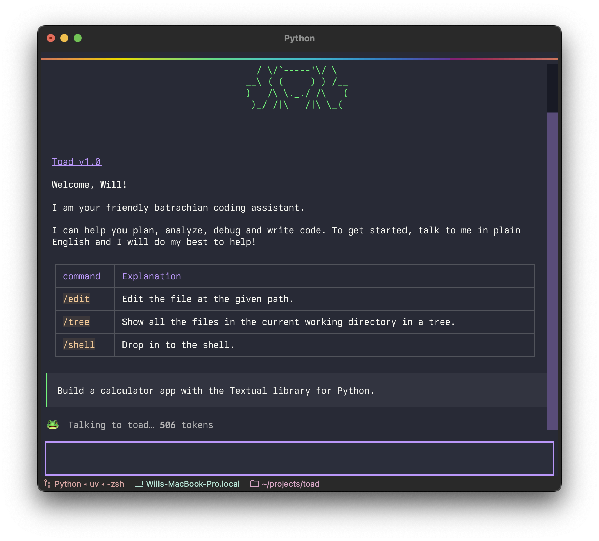
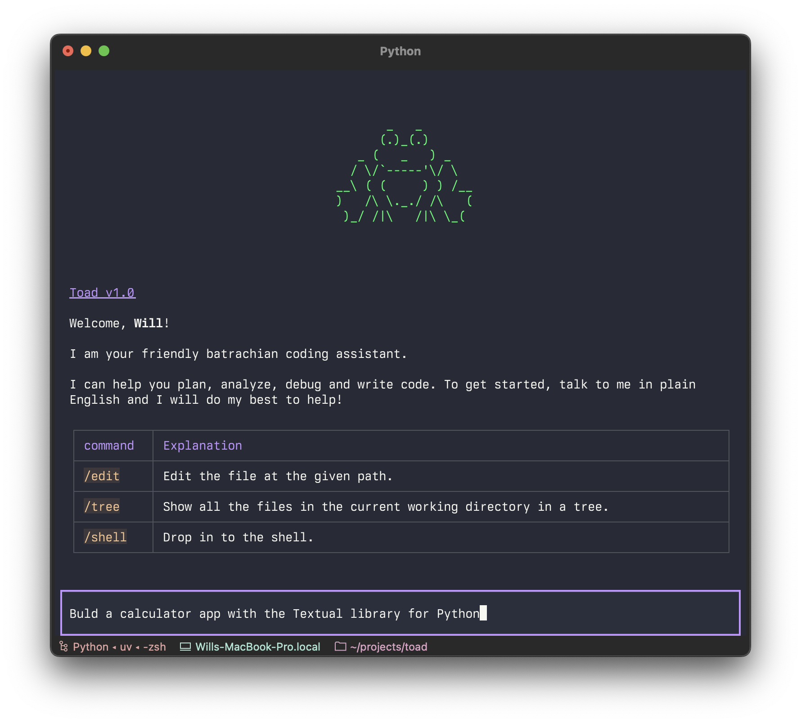
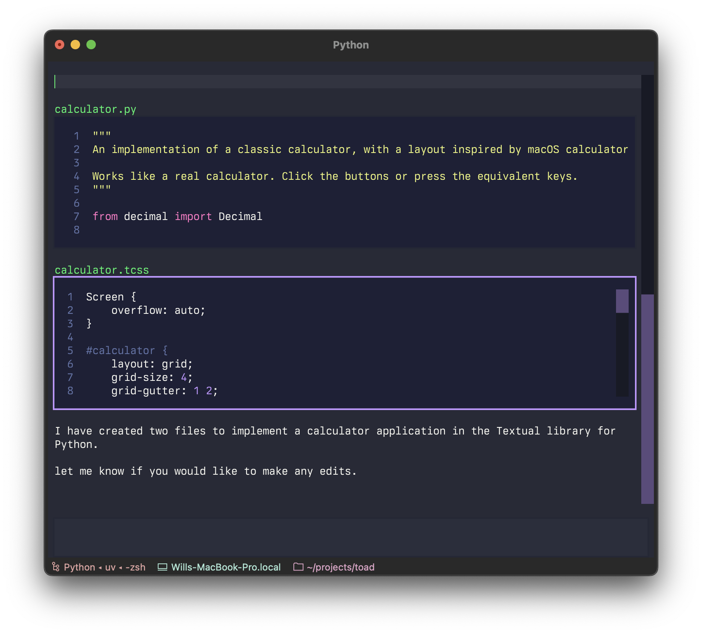

I'm a little salty that neither Anthropic nor Google reached out to me before they released their terminal-based AI coding agents.

You see until recently I was the CEO of Textualize, a startup promoting rich applications for the terminal.
Textualize didn't make it as a company, but I take heart that we built something amazing.
There is now a thriving community of folk building TUIs that I am still a part of.

So you will understand why when I finally got round to checking out [Claude code](https://www.anthropic.com/claude-code) and [Gemini CLI](https://github.com/google-gemini/gemini-cli) I was more interested in the terminal interface than the AI magic it was performing.
And I was not impressed.
Both projects suffer from jank and other glitches inherent to terminals that we solved in Textualize years ago.

How did I react to this?
I did what any well adjusted code-monkey would do in this situation.
I built a prototype across two afternoons in a nerdy caffeine-fueled rage while listening to metal music.

|  |  |  |

I called it Textual Code originally, which became "Toad" (the same way as Hodor got his name). 
Although purely a UI prototype with mocked up API interactions, it was enough for me to confidently say this is how you build a terminal based AI coding agent.
We can have a jank free interface that remains light-weight and snappy without giving up the interactions we have all committed to muscle memory.

By "jank", I mean anything happening in the UI which is unpleasant to the eye or detracts from the user experience rather than enhances it.
Jank is typically a side-effect rather than an intentional design decision, since nobody would build in jank if they could avoid it.
The prime example being flicker.

Both Anthropic and Google's apps flicker due to the way they perform visual updates.
These apps update the terminal by removing the previous lines and writing new output (even if only a single line needs to change). 
This is a surprisingly expensive operation in terminals, and has a high likelihood you will see a partial frame&mdash;which will be perceive as flicker.
It also means that you can only update a maximum of a few pages before the flicker gets intolerable.
After that, content is committed to the terminal's scrollback buffer, and can't be changed.

Not everyone is sensitive to the flicker, but there are other problems with this approach.
If you resize the terminal, the output will be garbled if it doesn't happen to be in the last portion the app is keeping up-to-date.
And even if it isn't garbled, you can't select and copy more than a line of code without also copying line numbers, box drawing characters, and hard line breaks.
In fact, you generally can't interact with content in the scrollback buffer in any meaningful way.

Toad doesn't suffer from these issues.
There is no flicker, as it can update partial regions of the output as small as a single character.
You can also scroll back up and interact with anything that was previously written, including copying un-garbled output &mdash; even if it is cropped.
Here's an example of text selection:

*This is in the terminal. Text selection and copying works even if the code is cropped.*

This isn't a feature of terminals per se.
It is something the app has to manage itself.
But the work has already been done in [Textual](https://github.com/textualize/textual/).

So why didn't big tech use Textual and Python to build their terminal agents?
They would get text selection, smooth scrolling, flicker-free updates, app automation and snapshot testing, and a host of other feature that would have meant they could ship a better product faster.

I suspect the main reason that the creators came from a pool of front-end developers, and they used the terminal libraries in that ecosystem.
I am not unsympathetic to that.
Generally speaking the best language is the language you are most familiar with.
However now and again, the best language is the one with the best libraries.
And when it comes to TUIs, Textual is so far ahead of anything in JS and other ecosystems.

Even if Python isn't their thing, the architecture I have in mind would allow for the AI interactions to be in any language (more on that later).

I am clearly biased in this (massively so&mdash;I spent years working on Textual).
But even now, I maintain that if Anthropic and Google switched to Textual, they would overtake their current trajectory in a month or two.
Even if that included re-training in Python.

Let me quickly debunk some arguments against using Python for these things, in bullet list form because you didn't come here for tedious language wars...

- **Python is slow**. Python has gotten a lot faster over the years. And while it doesn't have the performance of some other languages, it is more than fast enough for a TUI. Textual runs just fine on a Raspberry Pi.
- **Python apps are hard to share**. This used to be true. But now we have [UV](https://docs.astral.sh/uv/) which can install cross-platform Python apps is easy as `npx`.
- **Python startup time is slow**. There is some truth in this, although we are only talking 100ms or so. I don't see any practical difference between Python and JS apps on the terminal.

## Licking the Toad

I'm currently taking a year's sabbatical to recover from managing the aforementioned startup.
At the time I genuinely thought I was sick of coding, and I could only stomach some light maintenance of Rich and Textual.
Turns out I wasn't sick of coding at all.
I still enjoy it, and I feel I could take on a hobby project while still focusing on my physical and mental health.

So I am going to build it.

What I have in mind is a universal front-end for AI services in the terminal.
This includes both AI chat-bots that you might use the browser for *and* agentic coding.

### Side quest - streaming markdown

LLMs converse in Markdown.
But when talking to an LLM via an API, the Markdown doesn't arrive all at once.
Rather you get fragments of markdown (known as tokens) which should be appended to an existing document.
Until recently the only way to render this in Textual was to remove the Markdown widget and add it back again with the updated markdown.
This worked, but it wasn't scalable since it gets slower to append content as the document grows.
I would need a smarter solution to achieve *streaming* Markdown.

*Streaming Markdown in Textual*

In a Textual Markdown widget, every part of the output it also a widget.
In other words, every paragraph, code fence, and table is a independent widget in its own right, with its own event loop.
Since the bottleneck was adding and removing these widgets, any solution would have to avoid or dramatically reduce the number of times that needs to occur.

The Python library I use for Markdown parsing, [markdown-it-py](https://markdown-it-py.readthedocs.io/en/latest/), doesn't support any kind of streaming, but it turned out that it is possible to build streaming on top of it (and possibly any library).
Markdown documents can be neatly divided in to top-level blocks, like a header, paragraph, code fence, table etc.
When you add to the document, only the very last block can change.
You can consider the blocks prior to the last to be finalized.

### Optimization 1.

This observation lead me to working on an optimization to avoid removing and re-creating these finalized blocks.
But there was a sticking point.
It turns out that the very last block can change its type when you add new content.
Consider a table where the first tokens add the headers to the table.
The parser considers that text to be a simple paragraph block up until the entire row has arrived, and then all-of-a-sudden the paragraph becomes a table.
Once I took that into account, it worked.
It was a massive win and streaming became more practical.

### Optimization 2.

The next step was to avoid replacing even last widget on new content.
This is unavoidable if the last block changes type, but if it didn't, I could add new content without replacing the widget (a far simpler operation in Textual).
The paragraph block, for instance, was trivial to update.
As was the code fence.
The table was more complicated, but still doable.
Replacing even a single widget per token could be expensive when new tokens arrive 100 times a second or higher.
So this update was a decent win.

### Optimization 3.

I could possibly have left it there, but there was one more outstanding optimization.
Markdown-it-py is an excellent library and really quite fast, but a very large document could take a few milliseconds to parse.
Multiply that by 100 tokens a second and it becomes significant.

I could reduce that parsing cost dramatically by only considering the last block in the document.
All it took was to store the line number where that last block began, and feed the parser the data from there to the end of the document.
This update meant that no matter how large the document is, parsing was always sub 1ms.

### Optimization 4.

This final optimization occurs not within the Markdown widget itself, but at a level above.

No matter how optimized appending to the markdown widget is, tokens could arrive faster than they can be displayed.
A naive solution would queue up these updates, so you see all the intermediate steps.
The problem with that is that your UI can be dutifully scrolling through content for many seconds after it has arrived.
I say if you have the output, let the user see it without delay.
They probably paid for the tokens, after all.

I fixed this with a buffer between the producer (the LLM) and the consumer (the Markdown widget).
When new tokens arrive before the previous update has finished, they are concatenated and stored until the widget is ready for them.
The end result is that the display is only ever a few milliseconds behind the data itself.

