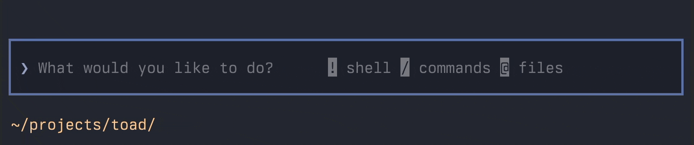

Welcome to the inaugural issue of the Toad Report, an irregular series where I document updates to Toad&mdash;my terminal interface for agentic coding and all things AI.

To quickly recap: Toad is intended to a *universal* front-end to AI services, which is entirely agnostic to the models and providers, while providing an altogether more humane user-experience.

<iframe width="100%" style="aspect-ratio:16/11;" src="https://www.youtube.com/embed/fSE44AuiC8k" title="Toad Report 1 - video demonstration" frameborder="0" allow="accelerometer; autoplay; clipboard-write; encrypted-media; gyroscope; picture-in-picture; web-share" referrerpolicy="strict-origin-when-cross-origin" allowfullscreen></iframe>

Recently I've been working on the prompt input, which will be the focus of this post.

## The Prompt Input

Like all good things in computing, Toad presents you with a flashing cursor and space to write something.

Toad's text input follows a number of conventions established by agentic coding tools.
There is plenty of room for innovation here, but if it ain't broke don't fix it &mdash; so the interactions will feel quite familiar to most devs (although I do intend to address a number of usability and quality of life issues left on the table).

The input is a competent text area with much of what you might expect from a browser or desktop app.
You can select text with both the mouse and the cursor, cut, copy, paste, undo and redo.

The input highlights Markdown quite well.
You can see this occurring in the previous animation, but it really comes in to its own when writing code fences where it can highlight a variety of different languages.
In the future I can see code fences grow a bunch of editing features like smart indentation and LSP support.

The default mode for the input is for editing the "prompt" for the large language model.
If you want to enter a shell command you can type a "!" or "$" to enter shell mode.
The prompt symbol and the highlight color changes, so you know can be sure which mode you are in.

Additionally, there are a number of blessed commands (which will ultimately be editable in the config) that trigger shell mode.
For the most part Toad will know wether you want to run a command or send a prompt to the AI.
And if you ever do want to send something which looks like a shell command to the LLM, you can hit escape to cancel shell mode.

Typing a forward slash brings up the slash command auto-complete.
You can navigate the available slash commands by moving the cursor through the list, or continue typing and have it narrow down the search, then right to insert the suggested command.

I haven't implemented any slash commands as yet, but I expect this list to grow.
I also plan on implementing the custom command system supported by other agentic coding tools.

Hitting the `@` key brings up a list of all the files in the project.
These can be refined by entering a *fuzzy* search, which matches paths with the letters you enter, but not necessarily contiguously.
This is way more intuitive that in sounds: you can start typing the name of the file and it will typically put it at the top of the list after a few keystrokes, or a enter a few characters from elsewhere in the path to match a subdirectory.

There is also a tree view of the project docked to the left side of the screen.
While not primarily designed to add paths to the prompt, it would be a nice feature to select a file in the tree and have it populate the prompt.

## Found this interesting?

Follow me on the socials where I will be posting regular updates.
You can also join the [Textual Discord Server](https://discord.gg/Enf6Z3qhVr) if you want to chat with me or the Textual community.
