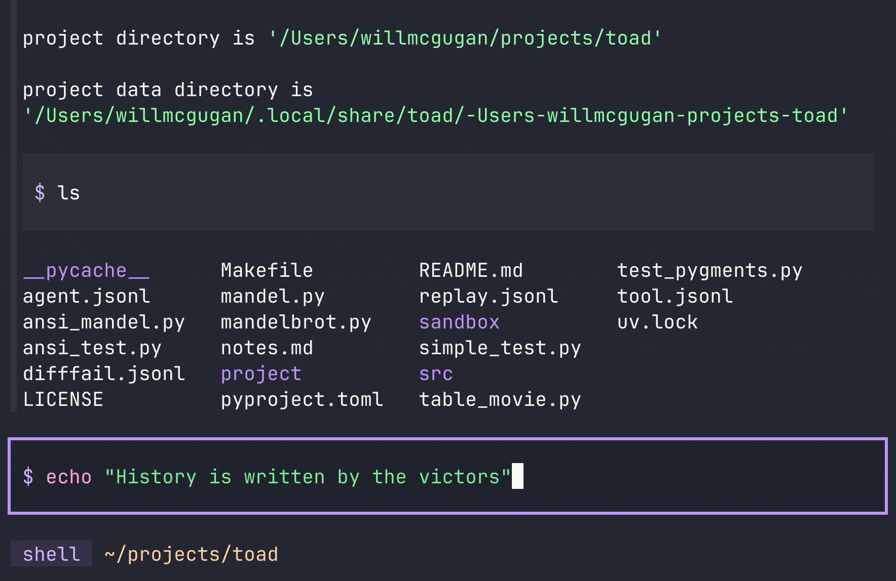
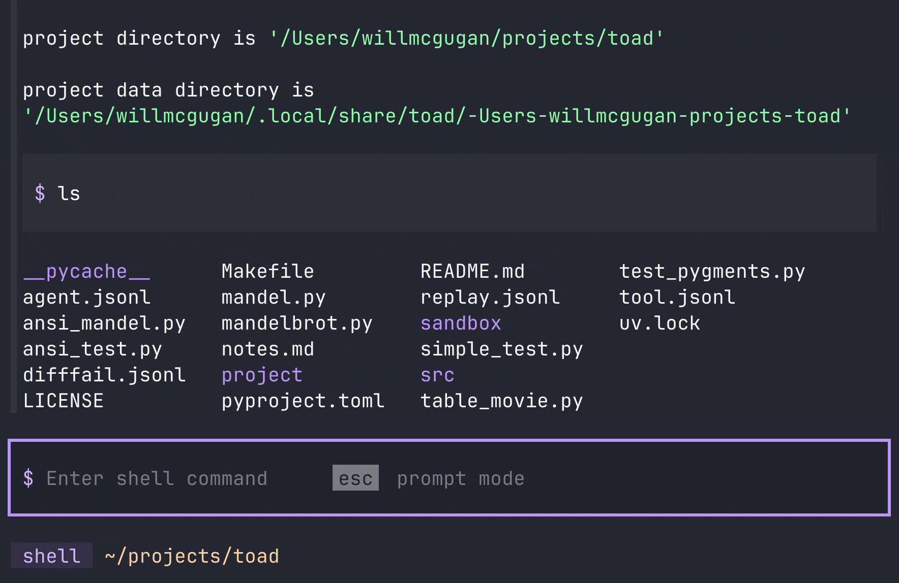
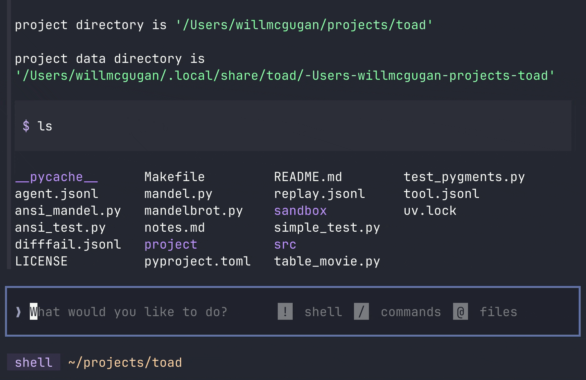

Welcome to the second issue of The Toad Report. If you are new here, Toad is a universal interface for AI I am currently building.

Things are moving (hopping) fast in the Toad world.
I recently implemented the [Agent Client Protocol](https://agentclientprotocol.com/protocol/initialization) in Toad, which means that Toad can now act as a front-end for Gemini, Claude, Codex, and a variety of other agentic coding solutions.

This is very exciting, as you can now use all these services from a single terminal interface.
And the UX is already leaps and hops ahead of big tech's CLIs.

Here is a video I recorded of Toad running Claude and Gemini head-to-head.

<iframe width="100%" style="aspect-ratio:16/11;" src="https://www.youtube.com/embed/OGGVdPZTc8E" title="claude v gemini" frameborder="0" allow="accelerometer; autoplay; clipboard-write; encrypted-media; gyroscope; picture-in-picture; web-share" referrerpolicy="strict-origin-when-cross-origin" allowfullscreen></iframe>

## Welcome OpenHands

I'm very happy to welcome [OpenHands](https://github.com/OpenHands/OpenHands) as my first corporate sponsor!
These guys are pioneers in agentic coding, and I look forward to getting OpenHands running on Toad.

## Toad's shell

Claude tells me that there is no species of toad that has a shell.
But Toad with a capital T does.

Having an integrated shell within agentic coding tools just makes sense.
But if Toad's shell can't match the basic features developers have developed muscle memory for, then it may as well not have a shell at all.
So in the last week I have added a number of traditional shell features.

The first is *history*: The ability to navigate through your recent shell commands and potentially re-use one.
Pressing `up` or `down` in Toad's prompt will move through the history.
Here it is in action:

Toad will offer to auto-complete commands from the history (in addition to some pre-configured favorites).
Hitting `return` will accept the suggestion, while `escape` will dismiss it.

Here is Toad auto-completing shell commands:

Finally, still in the realm of auto-completion, Toad will auto-complete filenames and paths.
If you hit `tab`, then Toad will look for any matching files or directories.
If it finds a single file, it will insert that filename.
If it finds more than one, it will insert any common characters and suggest the remaining characters in the filename.
You can hit `tab` again to cycle through those suggestions, and `return` or `escape` to accept or cancel.

Here is path auto-completion in action:

## Found this interesting?

Follow me on the socials where I will be posting regular updates.
You can also join the [Textual Discord Server](https://discord.gg/Enf6Z3qhVr) if you want to chat with me or the Textual community.

Join the `#toad` channel if you would like an invite to the Toad repository. I'll be sending more out in a week or two.

Thanks for reading!