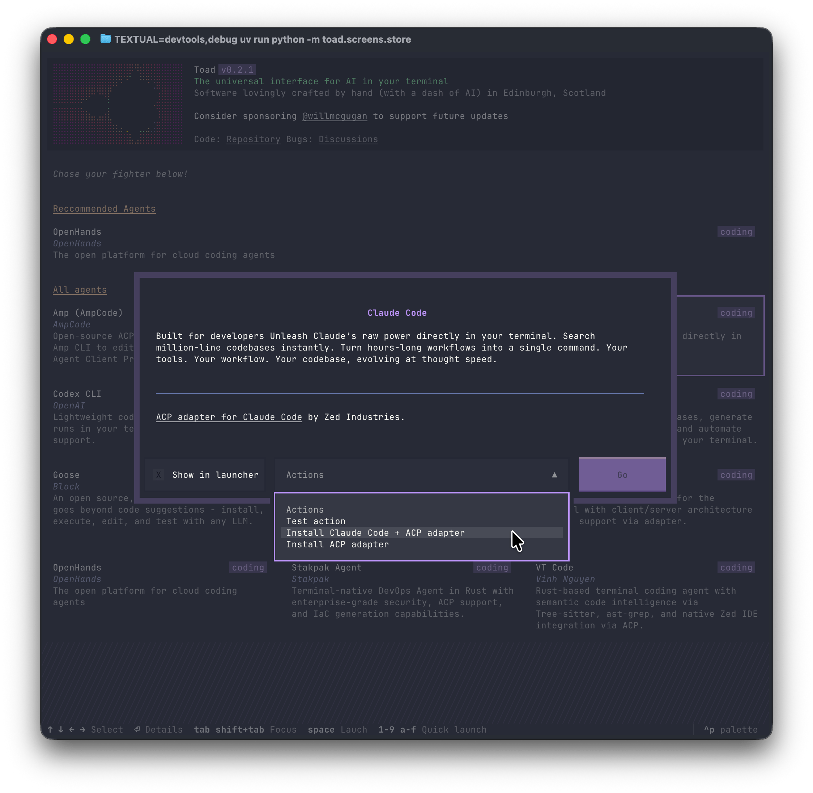
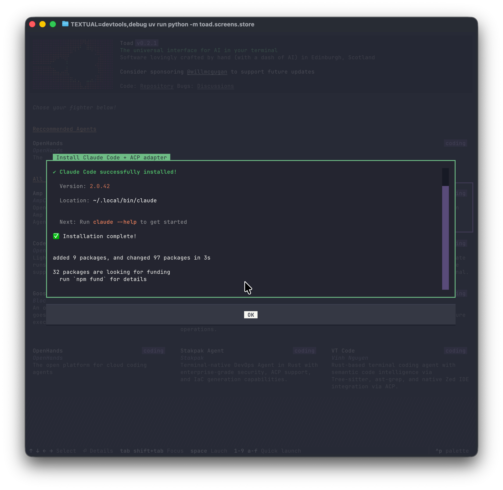
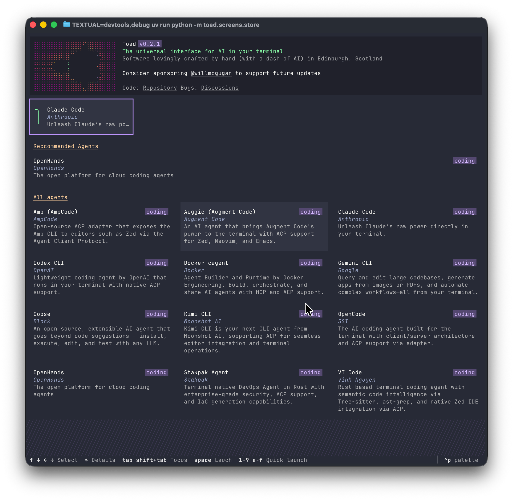

Welcome to the third issue of the Toad Report. If you are new here, Toad is a universal interface for API I am currently building.

To date, most of the my work on Toad has been spend in building the "conversation" view where the user can converse and interact with their chosen AI agent.
This has come together rather well, with a polished enough user experience for [Hugging Face](https://huggingface.co/) to start building integrations with their technology!
And all before Toad's official release.

<blockquote class="twitter-tweet" >
Some technologies are indistinguishable from magic... <a href="https://twitter.com/willmcgugan?ref_src=twsrc%5Etfw">@willmcgugan</a> <a href="https://t.co/6idsU3dIDa">pic.twitter.com/6idsU3dIDa</a>
&mdash; Shaun Smith (@evalstate) <a href="https://twitter.com/evalstate/status/1990347931249954872?ref_src=twsrc%5Etfw">November 17, 2025</a></blockquote> 

The conversation view can be considered the body of Toad.
But a body needs a head.
In the case of Toad, it needs an interface where the user can find, install, and launch agents.
Which is what Ive been working on recently.

The following will be the first view the user will see if they launch `toad` with no arguments:

From here the user can navigate the (growing) list of compatible agents.
When they select one of interest, Toad will pop up a dialog with information (in beautiful markdown) regarding the agent.

In this dialog is a pull down list of possible actions associated with the agent&mdash;where there will typically be at least an "install" action.

Clicking the "Go" button downloads and installs the agent without ever leaving the application.

When an agent is installed, it is placed in the "quick launch" area.
Each entry in the quick launch has a digit associated, so they can jump straight to that agent.

When an agent is selected (quick launch or other), the user can press space to launch the conversation view and begin their agentic coding session.

I wanted the experience to be as friction free as possible.
There are many coding agents out there, but not all of them have the same visibility as those offered by big tech.
I'm hoping this will promote the less well funded agents.

Here's a video a recorded of the installation process.
The interface is a little older than the screenshots, but you should get the idea...

<iframe width="100%" style="aspect-ratio:16/11;"  src="https://www.youtube.com/embed/xZvHS7wMFlk" title="toad store" frameborder="0" allow="accelerometer; autoplay; clipboard-write; encrypted-media; gyroscope; picture-in-picture; web-share" referrerpolicy="strict-origin-when-cross-origin" allowfullscreen></iframe>

## Found this interesting?

Follow me on the socials where I will be posting regular updates.
You can also join the [Textual Discord Server](https://discord.gg/Enf6Z3qhVr) if you want to chat with me or the Textual community.

Join the `#toad` channel if you would like an invite to the Toad repository. I'll be sending more out in a week or two.

Thanks for reading!