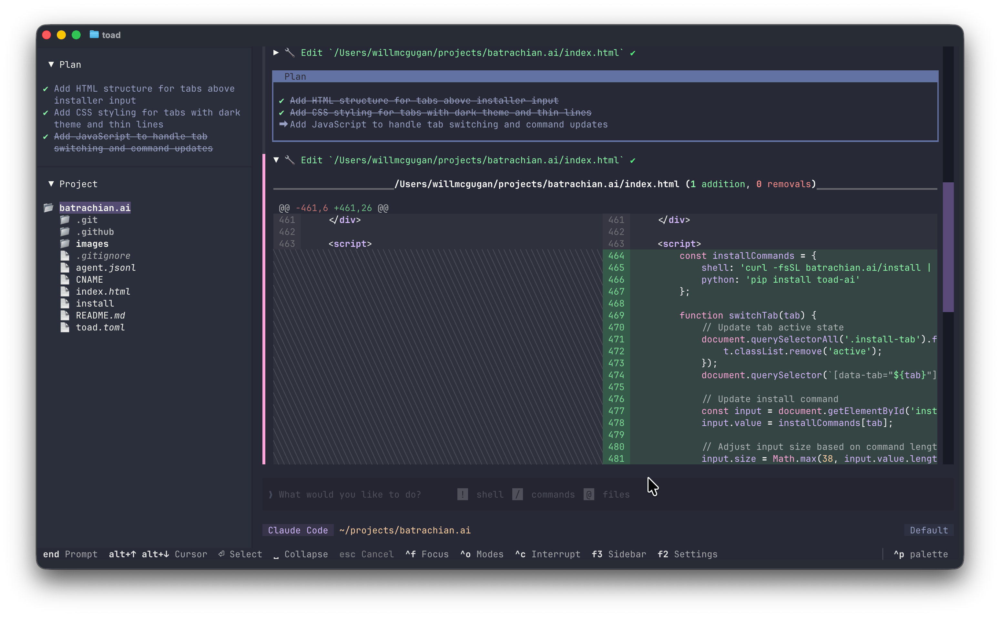
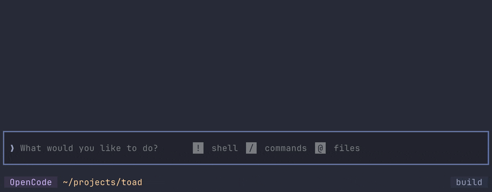
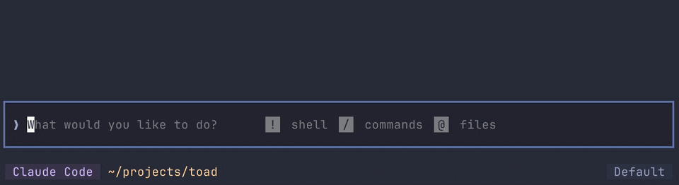
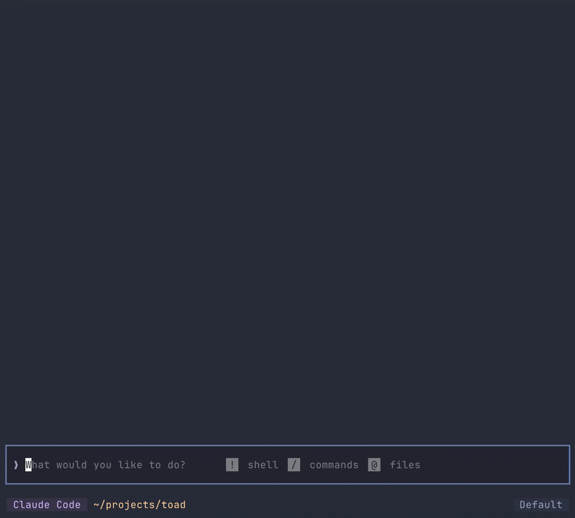
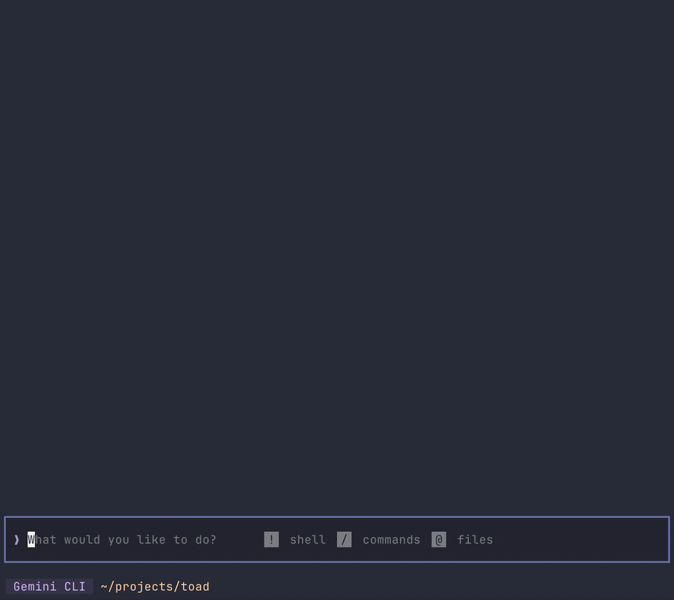
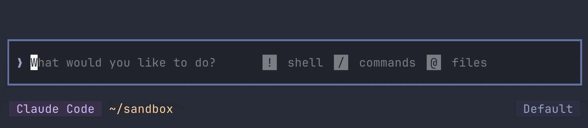
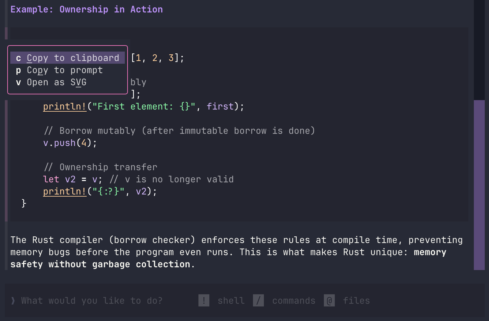

My startup for terminals wrapped up mid-2025 when the funding ran dry.
So I don't have money, but what I do have are a very particular set of skills.
Skills I have acquired over a very long career convincing terminals they are actually GUIs.

Skills which I have used to create a terminal app that offers a more pleasant experience for agentic coding.
Toad (a play on *Textual Code*) is a front-end for AI tools such as [OpenHands](https://openhands.dev/), [Claude Code](https://www.claude.com/product/claude-code), [Gemini CLI](https://geminicli.com/), and many more. 
All of which run seamlessly under a single terminal UI, thanks to the [ACP](https://agentclientprotocol.com/protocol/initialization) protocol.

At the time of writing, Toad supports 12 agent CLIs, and I expect many more to come online soon.

Here's a screenshot:

So what does Toad offer over the CLI apps from big tech?

It has most of the UI interactions users have come to expect from agentic coding, but hopefully more refined.
For instance the "@" character to bring in files into the context. Here's Toad's implementation:

A snappy *fuzzy* search which filters patterns from the project's `.gitignore` (if there is one). 

The prompt editor offers an experience which you might be surprised to find in a terminal.
You can navigate and select with the keyboard and mouse, select, cut, copy, paste, etc.
The prompt will highlight Markdown as you type (even syntax highlighting code fences *before* you close them).

Toad has really nice Markdown streaming, based on the techniques I described [here](https://willmcgugan.github.io/streaming-markdown/).
It remains fast with large documents, and renders everything from tables to syntax highlighted code fences.

Many other tools either don't bother to render the Markdown, or they do a fairly half-hearted job.

Another goal I had for Toad was to integrate a shell.
I wanted the conversation with AI to feel like a natural extension of a traditional terminal based workflow.

Most tools stop at displaying monochrome output from commands.
Some will break if you run something interactive, like a TUI.
Toad doesn't have this limitation, and will let you run all your CLI apps with full color, interactivity, and mouse support.

At the time of writing the only terminal based agentic coding tool I know of that runs dynamic commands inline is Gemini.

Toad adopts the convention of using a `!` character to introduce a shell command.
There is also a list of commands in settings which will automatically trigger shell mode.
In practice, this means that you rarely need to explicitly introduce shell commands—just type what's on your mind.

Toad borrows tab completion from the shell.
You'll appreciate this if you have worked in the terminal long enough to commit this interaction to muscle memory.
Hit tab to complete the command or path.
If there is more than one possibility you can hit tab again to cycle through them, and enter to accept.

In addition to the shell, Toad implements a few concepts from Jupyter notebooks.
You can cursor through previous conversation, moving a logical block at a time, and interactive with it again.
At the moment that feature is used as a convenience to copy content to the clipboard or prompt, and a few other niceties like exporting a SVG.

Toad will lean more heavily in to this kind of interaction in the future.

## Friends of Toad

I was very fortunate to collaborate with [OpenHands](https://openhands.dev/), who are doing some amazing work in this space. Check out their [blog post](https://www.openhands.dev/blog/20251218-openhands-toad-collaboration) on Toad!

I also collaborated with [Hugging Face](https://huggingface.co) on this release. Check out their blog post on their [inference explorers](https://huggingface.co/toad-hf-inference-explorers)!

## Try Toad

When this post is live you will be able to install Toad yourself.

The work is ongoing: a few missing features and interface improvements to be done, but Toad is solid enough to use as your daily driver for AI.
I used it to create [batrachian.ai](https://www.batrachian.ai), where you will find install instructions.

For more details, see the [Toad](https://github.com/batrachianai/toad) repository.

I need a break (sabbaticals are tiring), but I'll be picking things up in 2026.
I'm hoping that by the time my year off ends, Toad could become my full-time gig.
If you want to help make that happen, consider [sponsoring my work](https://github.com/sponsors/willmcgugan).

